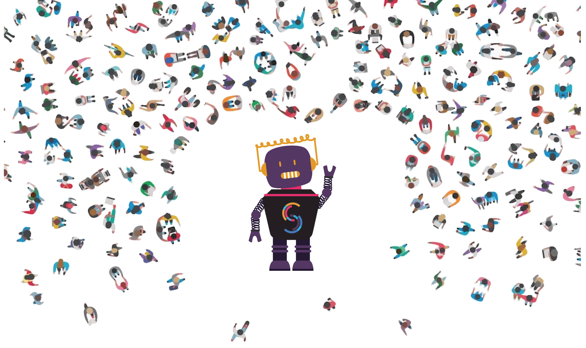

<h1 align="center">
	
	<br>
	<br>
</h1>

<br>
<br>

<p align="center">
  Simple project made in order to demo <a href="https://getstal.kr">stalkr</a> at <a href="https://developer.apple.com/wwdc/">WWDC 2017</a>
</p>

<br>

---

## Table of Contents

<!-- DO NOT EDIT THE COMMENTS BELOW -->

<!-- toc -->

- [This Project](#this-project)
  * [A Simple Micro Service](#a-simple-micro-service)
  * [A Bot](#a-bot)
- [Getting Started](#getting-started)
  * [The Micro Service](#the-micro-service)
  * [The Bot](#the-bot)
- [Our Product](#our-product)

<!-- tocstop -->

## This Project

This project basically consists of two things:

### A Simple Micro Service

Which gives us famous Apple product names and has two routes:

- `/all`: Which returns an `array` of products.

- `/random`: Which returns a `string` containing a random one.

This simple HTTP API is intended to be just a simple Proof of Concept and demo to our [main product](#our-product).

### A Bot

Which keeps breaking and fixing the micro service deploys in order to better demo it at one our clients.

## Getting Started

### The Micro Service

1. Clone this repository:

    ```sh
    git clone https://github.com/getstalkr/espinosa
    ```

1. Install all dependencies:

    ```sh
    # via npm
    npm install
    # or using yarn
    yarn
    ```

1. Launch it:

    ```sh
    # via npm
    npm start
    # or using yarn
    yarn start
    ```
If everything goes okay, then the endpoints should be available at `http:localhost:3000`.


### The Bot

Which keeps breaking and fixing the micro service deploys in order to better demo it at one our clients.

## Our Product

<p align="center">
	
</p>

*stalkr* is a simple–yet powerful–set of tools which gathers data from both continuous integration and application infrastructure monitoring tools in order to make it easier to monitor the whole developing process, in a way the entire team can see at a glance, from the very first commit to the final release.

Although our experimental release is a simple client made for the  TV, we do intend to make *stalkr* clients available on as much platforms as possible, which include:

- Other **Smart TV** platforms–e.g. Android TV, webOS, Tizen etc.;

- **SmartWatch** platforms–e.g. watchOS, Android Wear etc.;

- Popular **Mobile** platforms–e.g. iOS, Android etc.;

- Popular **Desktop** OSs–e.g. macOS, Linux, Windows etc.;

- The **Web** itself.

If you can't wait to check it out:

<p align="center">
  <a href="https://itunes.apple.com/br/app/stalkr-dashboard/id1214212674">
    
  </a>
</p>


---

**Maintainer**:

> [ythecombinator.me](https://ythecombinator.me) &nbsp;&middot;&nbsp;
> GitHub [@ythecombinator](https://github.com/ythecombinator) &nbsp;&middot;&nbsp;
> Twitter [@ythecombinator](https://twitter.com/ythecombinator)
